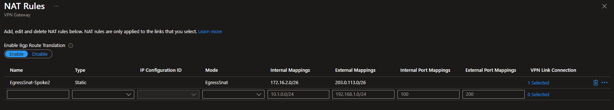

# Azure Virtual WAN — VPN NAT Lab

## TL;DR

This lab deploys an end-to-end **Azure Virtual WAN** environment with **VPN Site-to-Site NAT** demonstrating both **IngressSnat** (translate branch addresses as they enter the hub) and **EgressSnat** (translate spoke addresses as they leave toward a branch). NAT targets use public [RFC 5737](https://datatracker.ietf.org/doc/html/rfc5737) TEST-NET ranges — so you can **see NAT working** in route tables, tcpdump, and firewall logs without any ambiguity.

**What makes this different:** Most VPN NAT demos translate one RFC 1918 range to another (`10.x` → `172.x`), making it hard to tell if NAT is actually working. This lab uses reserved **public IP ranges** as the NAT target — when you see `203.0.113.x` in a route table or packet capture, you *know* that's a NAT'd address. It also demonstrates the **real-world pattern** of presenting spoke addresses as a different range to a remote partner (e.g., a financial institution's IPSEC worksheet requiring `203.0.113.0/26` instead of your actual `172.16.2.0/26`).

| Feature | Details |
|---------|---------|
| **NAT type** | Static (1:1) or Dynamic (PAT) — configurable |
| **NAT target** | RFC 5737 public TEST-NET ranges (not private) |
| **BGP** | Optional APIPA peering (169.254.x.x) via two-phase deploy |
| **Security** | Azure Firewall Premium + Routing Intent on both hubs |
| **Docs** | [Configure NAT rules for your Virtual WAN VPN gateway](https://learn.microsoft.com/en-us/azure/virtual-wan/nat-rules-vpn-gateway) |

> Based on [azure-vwan-secure-hub-lab](https://github.com/colinweiner111/azure-vwan-secure-hub-lab), extended with VPN S2S NAT rules.

<br>

---

# Architecture

## Static NAT (default)

> Static NAT is the default when deploying with `natType=Static` (or omitting the parameter entirely).

Each branch IP maps 1:1 to a public TEST-NET IP. Both sides can initiate traffic.


| Aspect | Details |
|--------|---------|
| Mapping | 1:1 address (`10.100.0.4` ↔ `203.0.113.4`) |
| External range | Must match internal size (`/24` → `/24`) |
| Initiation | Both sides can initiate |
| Deploy example | `-Hub1NatExternalRange "203.0.113.0/24"` |
| Use case | Full bidirectional access, PoC/demo |

---

## Dynamic NAT

Many branch IPs share a single external IP using port translation (PAT). Only the branch side can initiate.


With Dynamic NAT (`natType=Dynamic`), the VPN gateway uses **port address translation (PAT)** to map many branch IPs to a single (or few) external IPs. The external range can be as small as a `/32`.

| Aspect | Details |
|--------|---------|
| Mapping | Many-to-one with PAT (`10.100.0.*` → `203.0.113.1:port`) |
| External range | Can be smaller (`/24` → `/32`) |
| Initiation | Only the NAT'd side (branch) can initiate |
| Deploy example | `-Hub1NatExternalRange "203.0.113.1/32"` |
| Use case | Production overlapping branches, cost-conscious |

---

## Why Public IP Ranges for NAT?

Typical VPN NAT demos translate one private range to another (e.g., `10.x` → `172.x`). This lab uses **public IP ranges** as the NAT external mapping to demonstrate scenarios such as:

- **Routing clarity** — when checking effective routes or firewall logs, NAT'd traffic from branches is immediately distinguishable from spoke-to-spoke or spoke-to-internet flows
- **Multi-tenant isolation** — different branches (even with overlapping private space) can each be mapped to unique, easily identifiable public ranges
- **Compliance boundaries** — branch traffic entering the vWAN fabric appears as a public range, creating a clear trust boundary between on-premises and cloud

### RFC 5737 TEST-NET Ranges

The lab uses three /24 blocks that IANA has permanently reserved for documentation — they are **not routable on the public internet** and will never be assigned to any organization:

| Range | RFC Name | Used In This Lab | IANA Purpose |
|---|---|---|---|
| `203.0.113.0/24` | TEST-NET-3 | Hub1 NAT external mapping | Documentation & examples |
| `198.51.100.0/24` | TEST-NET-2 | Hub2 NAT external mapping | Documentation & examples |
| `192.0.2.0/24` | TEST-NET-1 | Available for expansion (see [Gotchas](#gotchas--lessons-learned) for why IngressSnat + EgressSnat can't share an external range) | Documentation & examples |

**Official references:**
- [RFC 5737](https://datatracker.ietf.org/doc/html/rfc5737) (IETF) — The authoritative standard defining these three /24 blocks
- [IANA IPv4 Special-Purpose Address Registry](https://www.iana.org/assignments/iana-ipv4-special-purpose-registry/iana-ipv4-special-purpose-registry.xhtml) — Master list of all reserved IPv4 ranges
- ARIN Whois — [203.0.113.0](https://search.arin.net/rdap/?query=203.0.113.0) / [198.51.100.0](https://search.arin.net/rdap/?query=198.51.100.0) — Shows these as IANA "SPECIAL-PURPOSE"

---

## How VPN NAT Works

Each hub VPN gateway can have **IngressSnat** and/or **EgressSnat** rules attached to branch connections.

### IngressSnat vs EgressSnat

| | IngressSnat | EgressSnat |
|---|---|---|
| **Direction** | Branch → Hub (ingress into the hub) | Hub → Branch (egress from the hub) |
| **What it NATs** | Branch addresses as they enter the hub | Spoke/hub addresses as they leave toward the branch |
| **Internal mapping** | Branch real range (e.g., `10.100.0.0/24`) | Spoke real range (e.g., `172.16.2.0/26`) |
| **External mapping** | What the hub sees (e.g., `198.51.100.0/24`) | What the branch sees (e.g., `203.0.113.0/26`) |
| **Use case** | Overlapping branch ranges, branch identity masking | Present spoke addresses differently to a remote partner |
| **Static NAT behavior** | Bidirectional — both sides can initiate | Bidirectional — both sides can initiate |

> **Key insight:** With **Static** NAT, a single rule handles both directions automatically. An EgressSnat rule with internal `172.16.2.0/26` → external `203.0.113.0/26` means: spoke-to-branch traffic has its source NAT'd from `172.16.2.x` to `203.0.113.x`, and branch-to-spoke traffic addressed to `203.0.113.x` is reverse-NAT'd back to `172.16.2.x`. You do **not** need both IngressSnat and EgressSnat for the same flow.

### Portal: NAT Rules Blade



> The NAT Rules blade on a vWAN VPN Gateway. Key elements: **Enable Bgp Route Translation** must be toggled on, each rule needs a **VPN Link Connection** associated (note "0 Selected" means the rule is inactive), and **Internal/External Port Mappings** are only needed for port-specific NAT.

### Static NAT Flow

Static NAT automatically handles both directions — source NAT in the named direction and reverse destination NAT in the opposite direction:

#### IngressSnat (Branch → Hub)

| Rule | Traffic Direction | Effect |
|---|---|---|
| **IngressSnat** | Branch → Hub | Source IP `10.100.0.x` translated to `198.51.100.x` (Hub2) |
| *(reverse)* | Hub → Branch | Destination IP `198.51.100.x` translated back to `10.100.0.x` automatically |

#### EgressSnat (Spoke → Branch)

| Rule | Traffic Direction | Effect |
|---|---|---|
| **EgressSnat** | Hub → Branch | Source IP `172.16.2.x` translated to `203.0.113.x` (Hub1) |
| *(reverse)* | Branch → Hub | Destination IP `203.0.113.x` translated back to `172.16.2.x` automatically |

> **Important:** IngressSnat and EgressSnat with the **same external mapping** on the **same connection** will silently fail — Azure accepts the PUT but quietly drops the `egressNatRules` attachment. Use **different external ranges** if you need both on the same connection (see [Gotchas](#gotchas--lessons-learned)).

#### Dynamic NAT Flow

Dynamic IngressSnat uses **port address translation (PAT)**, mapping many branch IPs to a single (or few) external IPs with unique source ports:

| Rule | Traffic Direction | Effect |
|---|---|---|
| **IngressSnat** | Branch → Hub | Source `10.100.0.x:srcPort` translated to `203.0.113.1:uniquePort` (Hub1) / `198.51.100.1:uniquePort` (Hub2) |
| *(reverse)* | Hub → Branch | Destination `203.0.113.1:uniquePort` reverse-translated back to `10.100.0.x:srcPort` |

> **Limitation:** With Dynamic NAT, only the **branch side** can initiate connections. Spoke VMs cannot initiate connections to the branch because there is no static 1:1 mapping to resolve the destination.

### APIPA BGP Peering (169.254.x.x)

When `useApipaBgp` is enabled (default), all BGP sessions use APIPA link-local addresses instead of the gateway’s default private IPs. This matches real-world B2B VPN deployments (like the Azure-to-Azure connectivity worksheets used by financial institutions).

| Peer | APIPA Address | Role |
|------|--------------|------|
| Branch (all sessions) | 169.254.21.2 | Branch VPN Gateway |
| Hub1 Instance 0 | 169.254.21.1 | vWAN VPN Gateway |
| Hub1 Instance 1 | 169.254.22.1 | vWAN VPN Gateway |
| Hub2 Instance 0 | 169.254.21.5 | vWAN VPN Gateway |
| Hub2 Instance 1 | 169.254.22.5 | vWAN VPN Gateway |

Azure supports APIPA addresses in the **169.254.21.0/24** and **169.254.22.0/24** ranges. All addresses are configurable via parameters.

### BGP Route Translation

The `enableBgpRouteTranslationForNat` flag on the VPN gateway ensures that:
- Routes advertised **into** the hub from the branch are automatically translated (the hub learns `203.0.113.0/24` instead of `10.100.0.0/24`)
- Spokes, other branches, and ExpressRoute connections all see the **post-NAT** prefix
- The DefaultRouteTable shows `203.0.113.0/24` with next hop `VPN_S2S_Gateway`

### Packet Flow — IngressSnat (Branch → Spoke via Hub2)

| Step | Source IP | Destination IP | Location |
|---|---|---|---|
| 1. Branch1-VM sends ping | `10.100.0.4` | `172.16.3.4` | Branch VNet |
| 2. Enters Hub2 VPN GW (IngressSnat) | **`198.51.100.4`** | `172.16.3.4` | Hub2 |
| 3. Routed through Azure Firewall | `198.51.100.4` | `172.16.3.4` | Hub2 |
| 4. Arrives at hub2-spoke1 VM | `198.51.100.4` | `172.16.3.4` | Spoke VNet |
| 5. Spoke VM replies | `172.16.3.4` | `198.51.100.4` | Spoke VNet |
| 6. Leaves Hub2 VPN GW (reverse NAT) | `172.16.3.4` | **`10.100.0.4`** | Hub2 |
| 7. Arrives at branch | `172.16.3.4` | `10.100.0.4` | Branch VNet |

### Packet Flow — EgressSnat (Spoke → Branch via Hub1)

This is the **BlackRock / OST pattern** — spoke `172.16.2.0/26` is presented to the branch as `203.0.113.0/26`:

| Step | Source IP | Destination IP | Location |
|---|---|---|---|
| 1. hub1-spoke2-vm sends ping | `172.16.2.4` | `10.100.0.4` | Spoke VNet |
| 2. Routed through Azure Firewall | `172.16.2.4` | `10.100.0.4` | Hub1 |
| 3. Leaves Hub1 VPN GW (EgressSnat) | **`203.0.113.4`** | `10.100.0.4` | Hub1 |
| 4. Arrives at branch1-vm | `203.0.113.4` | `10.100.0.4` | Branch VNet |
| 5. Branch1-VM replies | `10.100.0.4` | `203.0.113.4` | Branch VNet |
| 6. Enters Hub1 VPN GW (reverse EgressSnat) | `10.100.0.4` | **`172.16.2.4`** | Hub1 |
| 7. Routed through Azure Firewall | `10.100.0.4` | `172.16.2.4` | Hub1 |
| 8. Arrives at spoke2 VM | `10.100.0.4` | `172.16.2.4` | Spoke VNet |

> **Note:** With EgressSnat, the branch sees `203.0.113.x` as the source — it never learns the real spoke address `172.16.2.x`. This is exactly how financial IPSEC worksheets work: each party agrees on a "presented" address range.

---

## Prerequisites

- **PowerShell 7+** — Uses pwsh syntax. Install from [https://aka.ms/PSWindows](https://aka.ms/PSWindows)
- **Azure Subscription** with sufficient quota
- **RBAC Role** — Owner or Contributor at subscription level
- **Azure CLI** — Logged in with `az login`

> **Cost Warning:** This lab deploys Azure Firewall (Premium), VPN Gateways, and Bastion Standard — these have hourly costs. See [Cleanup](#cleanup) when done.

---

## Deployment

The deploy script uses a **two-phase approach**:

1. **Phase 1 (Bicep):** Deploys all infrastructure — vWAN, hubs, gateways, NAT rules, VPN connections, firewalls, VMs, and Bastion. Hub VPN connections are created *without* APIPA custom BGP addresses.
2. **Phase 2 (REST API, only when `UseApipaBgp=$true`):** Sets APIPA `customBgpIpAddresses` on the hub VPN gateways via REST PUT, then updates the hub connections with `vpnGatewayCustomBgpAddresses`.

> **Why two phases?** vWAN VPN gateways (`Microsoft.Network/vpnGateways`) silently ignore `customBgpIpAddresses` in `bgpSettings` during initial ARM/Bicep creation. The addresses can only be set via REST API PUT on an already-provisioned gateway. This is a platform limitation.

```powershell
# Clone and deploy
git clone <repo-url>
cd azure-vwan-vpn-nat-lab

# Deploy with defaults (APIPA BGP + Static NAT)
.\deploy-bicep.ps1 -ResourceGroupName vwan-vpn-nat-lab -Location westus3

# Or customize the NAT ranges
.\deploy-bicep.ps1 `
    -ResourceGroupName vwan-vpn-nat-lab `
    -Location westus3 `
    -BranchInternalRange "10.100.0.0/24" `
    -Hub1NatExternalRange "203.0.113.0/24" `
    -Hub2NatExternalRange "198.51.100.0/24"

# Deploy with Dynamic NAT (many-to-few with port translation)
.\deploy-bicep.ps1 `
    -ResourceGroupName vwan-vpn-nat-lab `
    -Location westus3 `
    -NatType Dynamic `
    -BranchInternalRange "10.100.0.0/24" `
    -Hub1NatExternalRange "203.0.113.1/32" `
    -Hub2NatExternalRange "198.51.100.1/32"

# Deploy without APIPA BGP (Phase 2 is skipped — single-phase Bicep only)
.\deploy-bicep.ps1 -UseApipaBgp $false

# Deploy with EgressSnat on Hub1 (spoke 172.16.2.0/26 → 203.0.113.0/26 toward branch)
.\deploy-bicep.ps1 `
    -ResourceGroupName vwan-vpn-nat-lab `
    -Location westus3 `
    -EnableHub1EgressSnat $true `
    -Hub1EgressInternalRange "172.16.2.0/26" `
    -Hub1EgressExternalRange "203.0.113.0/26"
```

Deployment takes approximately **60–90 minutes** for Phase 1 (VPN gateways are the bottleneck), plus **~10 minutes** for Phase 2 APIPA configuration.

### Parameters

| Parameter | Default | Description |
|---|---|---|
| `ResourceGroupName` | `vwan-vpn-nat-lab` | Resource group name |
| `Location` | `westus3` | Azure region |
| `AdminUsername` | `azureuser` | VM admin user |
| `AdminPassword` | *(prompted)* | VM admin password |
| `FirewallSku` | `Premium` | Azure Firewall SKU |
| `BranchInternalRange` | `10.100.0.0/24` | Branch subnet to NAT (pre-NAT) |
| `Hub1NatExternalRange` | `203.0.113.0/24` | Hub1 public NAT range (post-NAT) |
| `Hub2NatExternalRange` | `198.51.100.0/24` | Hub2 public NAT range (post-NAT) |
| `NatType` | `Static` | NAT rule type: `Static` (1:1 mapping) or `Dynamic` (many-to-few PAT) |
| `UseApipaBgp` | `$true` | Use APIPA addresses (169.254.x.x) for BGP peering |
| `EnableHub1EgressSnat` | `$false` | Deploy EgressSnat on Hub1 (spoke → branch NAT) |
| `Hub1EgressInternalRange` | `172.16.2.0/26` | Spoke real range for EgressSnat (pre-NAT) |
| `Hub1EgressExternalRange` | `203.0.113.0/26` | What the branch sees (post-NAT) |

---

## What Gets Deployed

- **Virtual WAN** + two Secured Virtual Hubs
- **4 Spoke VNets** (2 per hub) with VMs
- **1 Branch VNet** with VPN Gateway (BGP ASN 65010)
- **2 Hub VPN Gateways** with:
  - `enableBgpRouteTranslationForNat: true`
  - Configurable IngressSnat NAT rules (Static or Dynamic) via Bicep
  - Optional EgressSnat rules (Static) added via REST API / Portal for spoke-to-branch NAT
  - Optional APIPA BGP custom peering addresses (169.254.x.x)
- **2 Azure Firewalls** (Hub SKU) with Routing Intent (InternetAndPrivate)
- **Azure Bastion** (Standard, IP-based connections)
- **5 Ubuntu VMs** with traceroute pre-installed
- **Log Analytics** + Firewall diagnostic settings

### VM Network Information

| VM Name | VNet | Actual IP Range | NAT'd as (Hub1) | NAT'd as (Hub2) | NAT Rule |
|---------|------|-----------------|------------------|-------------------|----------|
| branch1-vm | branch1 | 10.100.0.0/24 | *(no IngressSnat on hub1)* | 198.51.100.0/24 | Hub2 IngressSnat |
| hub1-spoke1-vm | hub1-spoke1 | 172.16.1.0/27 | *(no NAT)* | *(no NAT)* | — |
| hub1-spoke2-vm | hub1-spoke2 | 172.16.2.0/27 | 203.0.113.0/26 → branch sees this | *(no NAT)* | Hub1 EgressSnat |
| hub2-spoke1-vm | hub2-spoke1 | 172.16.3.0/27 | *(no NAT)* | *(no NAT)* | — |
| hub2-spoke2-vm | hub2-spoke2 | 172.16.4.0/27 | *(no NAT)* | *(no NAT)* | — |

> **Current deployed state:** Hub1 has EgressSnat (spoke2 → `203.0.113.0/26`), Hub2 has IngressSnat (branch → `198.51.100.0/24`). This demonstrates **both** NAT directions in a single lab.

---

## Testing & Verifying NAT

### 1. Verify NAT Rules via CLI

Confirm the NAT rules are deployed:

```powershell
# Hub1 NAT rules (should show EgressSnat-Spoke2)
az network vpn-gateway nat-rule list --gateway-name hub1-vpngw -g vwan-natdemo -o table

# Hub2 NAT rules (should show IngressSnat-Branch1)
az network vpn-gateway nat-rule list --gateway-name hub2-vpngw -g vwan-natdemo -o table
```

Expected output:

| Hub | Name | Mode | Internal | External |
|---|---|---|---|---|
| Hub1 | EgressSnat-Spoke2 | EgressSnat | 172.16.2.0/26 | 203.0.113.0/26 |
| Hub2 | IngressSnat-Branch1 | IngressSnat | 10.100.0.0/24 | 198.51.100.0/24 |

### 2. Verify NAT Rule Bound to VPN Connection

```powershell
# Hub1 — should show egressNatRules referencing EgressSnat-Spoke2
az network vpn-gateway connection show \
  --gateway-name hub1-vpngw -g vwan-natdemo \
  -n site-branch1-conn \
  --query "{status:provisioningState, egressNat:vpnLinkConnections[0].egressNatRules, ingressNat:vpnLinkConnections[0].ingressNatRules}" \
  -o json

# Hub2 — should show ingressNatRules referencing IngressSnat-Branch1
az network vpn-gateway connection show \
  --gateway-name hub2-vpngw -g vwan-natdemo \
  -n site-branch1-conn \
  --query "{status:provisioningState, egressNat:vpnLinkConnections[0].egressNatRules, ingressNat:vpnLinkConnections[0].ingressNatRules}" \
  -o json
```

Hub1 should have `egressNatRules` populated (and no `ingressNatRules`). Hub2 should have `ingressNatRules` populated (and no `egressNatRules`).

### 3. Check Effective Routes — Azure Firewall (Best View)

This is the **best visual proof** of NAT working. In the Azure Portal:

1. Navigate to **Virtual WAN → Hubs → hub1 (or hub2) → Effective Routes**
2. Set **Choose resource type** = `Azure Firewall`
3. Set **Resource** = `hub1-azfw` or `hub2-azfw`

What to look for on **hub1-azfw** (EgressSnat hub):

| Prefix | Next Hop Type | Next Hop | Meaning |
|---|---|---|---|
| **203.0.113.0/26** | VPN_S2S_Gateway | hub1-vpngw | EgressSnat — spoke2 presented as this range to branch |
| **198.51.100.0/24** | Remote Hub | hub2 | Hub2's IngressSnat'd branch range |
| 172.16.1.0/24 | Virtual Network Connection | hub1-spoke1-conn | Hub1's local spoke |
| 172.16.3.0/24 | Remote Hub | hub2 | Hub2's spoke, learned via inter-hub |

What to look for on **hub2-azfw** (IngressSnat hub):

| Prefix | Next Hop Type | Next Hop | Meaning |
|---|---|---|---|
| **198.51.100.0/24** | VPN_S2S_Gateway | hub2-vpngw | Hub2's own IngressSnat'd branch range |
| **203.0.113.0/26** | Remote Hub | hub1 | Hub1's EgressSnat range, learned via inter-hub |
| 172.16.3.0/24 | Virtual Network Connection | hub2-spoke1-conn | Hub2's local spoke |
| 172.16.1.0/24 | Remote Hub | hub1 | Hub1's spoke, learned via inter-hub |

> **Key insight:** The firewall sees the **translated** public ranges (`203.0.113.0/24`, `198.51.100.0/24`), proving NAT occurs at the VPN gateway before traffic reaches the firewall.

### 4. Check Effective Routes — Spoke VM NIC

```powershell
az network nic show-effective-route-table -g vwan-natdemo -n hub1-spoke1-vm-nic -o table
```

With Routing Intent enabled, you'll see broad aggregates (`0.0.0.0/0`, `10.0.0.0/8`, `172.16.0.0/12`) pointing to the Azure Firewall. The specific NAT'd prefix isn't visible here — it's abstracted behind the firewall. This is **expected behavior** with Routing Intent.

### 5. Live Traffic Test — tcpdump (The Money Shot)

This proves end-to-end NAT translation with actual packets.

#### EgressSnat Test (Hub1 — Spoke → Branch)

**Terminal 1:** Connect to `branch1-vm` via Bastion, start capture:

```bash
sudo tcpdump -i eth0 icmp -n
```

**Terminal 2:** Connect to `hub1-spoke2-vm` via Bastion, ping the branch:

```bash
ping 10.100.0.4
```

**What you see on branch1's tcpdump:**

```
203.0.113.4 > 10.100.0.4: ICMP echo request
10.100.0.4 > 203.0.113.4: ICMP echo reply
```

The source is **`203.0.113.4`** (NAT'd spoke2), NOT `172.16.2.4` (spoke real IP). The branch never sees the actual spoke address.

#### IngressSnat Test (Hub2 — Branch → Spoke)

**Terminal 1:** Connect to `hub2-spoke1-vm` via Bastion, start capture:

```bash
sudo tcpdump -i eth0 icmp -n
```

**Terminal 2:** Connect to `branch1-vm` via Bastion, ping the spoke:

```bash
ping 172.16.3.4
```

**What you see on hub2-spoke1's tcpdump:**

```
198.51.100.4 > 172.16.3.4: ICMP echo request
172.16.3.4 > 198.51.100.4: ICMP echo reply
```

The source is **`198.51.100.4`** (NAT'd branch), NOT `10.100.0.4` (branch real IP).

> **Note:** The VPN tunnels must be in **Connected** state for this test. Since the lab uses a simulated branch (VNet + VPN Gateway), tunnels auto-negotiate after deployment. Allow a few minutes after deployment completes.

### 6. Verify VPN Tunnel Status

```powershell
# Check branch-side connections
az network vpn-connection list -g vwan-natdemo \
  --query "[].{name:name, status:connectionStatus}" -o table
```

### 7. Azure Firewall Logs (KQL)

After generating traffic (ping test above), query Log Analytics to see the firewall processing NAT'd traffic:

```kql
// Resource-specific table (if enabled)
AZFWNetworkRule
| where TimeGenerated > ago(30m)
| where SourceIp startswith "203.0.113" or SourceIp startswith "198.51.100"
| project TimeGenerated, SourceIp, DestinationIp, DestinationPort, Protocol, Action
| order by TimeGenerated desc
```

```kql
// Legacy diagnostics table (fallback)
AzureDiagnostics
| where Category == "AzureFirewallNetworkRule"
| where msg_s contains "203.0.113" or msg_s contains "198.51.100"
| project TimeGenerated, msg_s
| order by TimeGenerated desc
```

The firewall logs show the **NAT'd source IP** (`203.0.113.x`), confirming translation happens at the VPN gateway **before** the firewall inspects the traffic.

### 8. Verify BGP Route Translation

Check that the VPN gateway advertises the NAT'd prefix, not the original:

```powershell
# Show VPN gateway BGP settings
az network vpn-gateway show -g vwan-natdemo -n hub1-vpngw \
  --query "{bgpEnabled:bgpSettings.asn, natTranslation:enableBgpRouteTranslationForNat}" -o json
```

`enableBgpRouteTranslationForNat` should be `true`, meaning:
- Hub1 advertises `203.0.113.0/26` (the EgressSnat external range) to branches via BGP
- Hub2 advertises `198.51.100.0/24` (not `10.100.0.0/24`) to spokes and other hubs

### Quick Summary: What to Show a Customer

| Demo Step | What It Proves | Effort |
|---|---|---|
| Firewall Effective Routes (Portal) | NAT'd public ranges in routing table | 30 seconds |
| NAT Rules via CLI | IngressSnat + EgressSnat configuration | 30 seconds |
| tcpdump — EgressSnat (spoke→branch) | Spoke IP translated to `203.0.113.x` at branch | 2 minutes |
| tcpdump — IngressSnat (branch→spoke) | Branch IP translated to `198.51.100.x` at spoke | 2 minutes |
| Firewall KQL logs | Firewall sees NAT'd IPs, not original | 1 minute |
| BGP translation flag | Routes advertised post-NAT automatically | 30 seconds |

---

## Key Bicep Resources (NAT-specific)

The NAT configuration lives in [modules/vpn.bicep](modules/vpn.bicep):

```bicep
// IngressSnat — translates branch addresses entering the hub
// Deployed via Bicep (Hub2 in the current lab state)
resource hub2IngressNat 'Microsoft.Network/vpnGateways/natRules@2023-11-01' = {
  parent: hub2VpnGw
  name: 'IngressSnat-Branch1'
  properties: {
    type: natType       // 'Static' or 'Dynamic'
    mode: 'IngressSnat'
    internalMappings: [{ addressSpace: '10.100.0.0/24' }]    // Pre-NAT (branch actual)
    externalMappings: [{ addressSpace: '198.51.100.0/24' }]  // Post-NAT (what hub sees)
  }
}

// EgressSnat — translates spoke addresses leaving toward the branch
// Added via REST API / Portal (Hub1 in the current lab state)
// This is the "BlackRock pattern": present spoke 172.16.2.0/26 as 203.0.113.0/26
resource hub1EgressNat 'Microsoft.Network/vpnGateways/natRules@2023-11-01' = {
  parent: hub1VpnGw
  name: 'EgressSnat-Spoke2'
  properties: {
    type: 'Static'
    mode: 'EgressSnat'
    internalMappings: [{ addressSpace: '172.16.2.0/26' }]    // Pre-NAT (spoke actual)
    externalMappings: [{ addressSpace: '203.0.113.0/26' }]   // Post-NAT (what branch sees)
  }
}

// Hub connections reference NAT rules by ID
resource hub1BranchConn 'Microsoft.Network/vpnGateways/vpnConnections@2023-11-01' = {
  parent: hub1VpnGw
  name: 'site-branch1-conn'
  properties: {
    vpnLinkConnections: [{
      properties: {
        egressNatRules: [{ id: hub1EgressNat.id }]   // EgressSnat on hub1
        // vpnGatewayCustomBgpAddresses added by deploy script Phase 2
      }
    }]
  }
}
```
```

### Two-Phase APIPA Architecture Note

vWAN VPN gateways ignore `customBgpIpAddresses` during initial ARM creation. The deploy script handles this with a proven workaround:

1. **Bicep (Phase 1):** Creates gateways, NAT rules, connections — all without APIPA on hub side
2. **REST PUT (Phase 2a):** Sets `customBgpIpAddresses` on each hub VPN gateway's `bgpSettings.bgpPeeringAddresses`
3. **REST PUT (Phase 2b):** Updates hub connections with `vpnGatewayCustomBgpAddresses` referencing the now-present APIPA addresses

Branch-side APIPA (traditional `Microsoft.Network/virtualNetworkGateways`) works fine in Bicep — no workaround needed.

---

## Accessing VMs via Azure Bastion

Same as the base lab — use **IP-based connection** via Bastion Standard:

1. Navigate to **Azure Portal → Bastions → SharedBastion**
2. Select **Connect via IP address**
3. Enter the private IP of the target VM
4. Username: `azureuser`, password: as set during deployment

> **Routing Intent Note:** The Bastion VNet connection has `enableInternetSecurity: false` to allow Bastion control-plane connectivity.

---

## Cleanup

```powershell
az group delete -n vwan-natdemo --yes --no-wait
```

---

## Gotchas & Lessons Learned

### 1. IngressSnat + EgressSnat Cannot Share an External Range on the Same Connection

If you create an IngressSnat rule and an EgressSnat rule that both use `203.0.113.0/26` as the external mapping, and attach both to the **same** VPN connection, Azure will accept the REST PUT but **silently drop** the `egressNatRules` attachment. The connection will show only `ingressNatRules`.

**Workaround:** Use different external ranges. For example, IngressSnat → `198.51.100.0/24`, EgressSnat → `203.0.113.0/26`.

### 2. Static NAT Is Bidirectional — You Usually Only Need One Rule

With **Static** NAT, a single rule handles both directions. If you only need to present spoke addresses differently to the branch (the BlackRock pattern), a single **EgressSnat** rule is sufficient — you don't also need an IngressSnat.

Conversely, if you only need to translate branch addresses for the hub, a single **IngressSnat** rule is sufficient.

### 3. Dynamic NAT Is Unidirectional

With **Dynamic** NAT (PAT), only the **internal** side (the side whose addresses are being NAT'd) can initiate connections. The remote side cannot initiate because there's no static 1:1 mapping to resolve.

### 4. Updating a NAT Rule's Mappings In-Place May Not Work

REST API PUT to update an existing NAT rule's `internalMappings` or `externalMappings` may appear to succeed (200 OK) but keep the old values. **Solution:** Detach the rule from all connections, delete it, recreate with new mappings, and re-attach.

### 5. Phase 2 REST PUT Must Preserve Full Gateway State

When updating a vWAN VPN gateway via REST PUT (e.g., to add APIPA BGP addresses), you must GET the full gateway object first, merge your changes, and PUT back the complete object. A minimal PUT body will **replace** the entire gateway config, wiping connections and NAT rules.

---

## References

- [Configure NAT rules for your Virtual WAN VPN gateway](https://learn.microsoft.com/en-us/azure/virtual-wan/nat-rules-vpn-gateway) — The primary doc this lab implements
- [RFC 5737 — IPv4 Address Blocks Reserved for Documentation](https://datatracker.ietf.org/doc/html/rfc5737) — Why we use 203.0.113.0/24 and 198.51.100.0/24
- [Virtual WAN Site-to-Site VPN](https://learn.microsoft.com/en-us/azure/virtual-wan/virtual-wan-site-to-site-portal)
- [Routing Intent and Policies](https://learn.microsoft.com/en-us/azure/virtual-wan/how-to-routing-policies)

## Credits

Based on [azure-vwan-secure-hub-lab](https://github.com/colinweiner111/azure-vwan-secure-hub-lab), itself adapted from Daniel Mauser's [azure-virtualwan](https://github.com/dmauser/azure-virtualwan) work.

---

MIT Licensed.
